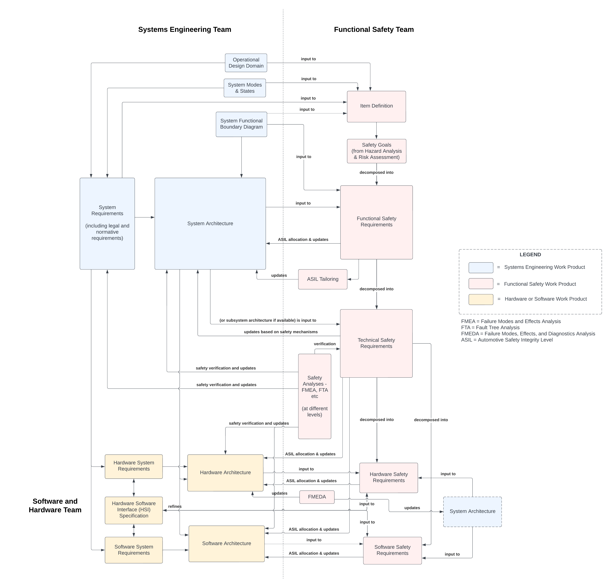

# Integrated Safety Lifecycle for Autonomous Systems

Summary: A view of the safety lifecycle integrating ISO 26262, ISO 21448 (SOTIF), and ISO 8800 for autonomous system safety.

---

Traditionally, automotive systems rely on ISO 26262 to define the functional safety lifecycle, covering state-of-the-art framework and methodology for reducing risk of hazards caused by malfunctioning of safety related Electrical/Electronic (E/E) systems. The following flowchart attempts to understand the traditional ISO 26262 safety lifecycle from a work product point of view. The flowchart paricularly captures the interactions between systems engineering, software, hardware, and functional safety work products (only the left side of the systems-V is represented). Note that the flowchart does not capture some of the interactions - for example, integration and testing efforts, verification reviews and confirmation reviews etc.

With the introduction of AI-driven functionality in autonomous systems, this traditional lifecycle (represented above) must be extended to support a comprehensive safety case and to address unique safety challenges associated with the usage of AI. An extended safety lifecycle for present day autonomous systems would be based on the following:
1. ISO 26262 - to address hazards due to malfunctioning behavior of safety-related E/E systems
2. ISO 21448 - to address hazards associated with functional insufficiencies, reasonably foreseeable misuse, and driving in complex environment
3. ISO 8800 - to address hazards associated with output insufficiencies, systematic errors, and random hardware errors of AI elements.

The goal or intent here is to build on top of the foundational safety lifecycle from ISO 26262 to address hazards not covered within the scope of ISO 26262. In most cases, the extended safety lifecycle (from ISO 21448 and ISO 8800) would be parallel safety lifecycle activities that go hand in hand with the traditional ISO 26262 safety-V lifecyle. A few examples illustrating this from ISO 21448 are as follows:
1. "Specification and Design" from ISO 21448 is closely associated with "Item Definition" from ISO 26262 to understand the system's scope, functionality, and constraints
2. "Vehicle-level SOTIF strategy and Driving Policy" from ISO 21448 is closely associated with "Safety Goals/Functional Safety Requirements" from ISO 26262
3. "SOTIF HARA" from ISO 21448 is closely associated with the traditional "HARA" from ISO 26262
4. "SOTIF FMEAs" from ISO 21448 for evaluating functional insufficiencies and triggering conditions are closely associated with the traditional "FMEAs" from ISO 26262

This integrated approach to developing the safety lifecycle, along with guidance from safety related standards such as UL 4600 for robust safety case development and evidence-based safety argumentation, help in supporting a comprehensive safety case for safe autonomous deployment at scale.

Note that the safety approach presented above does not take into account several aspects that interact closely with the safety lifecycle - such as cybersecurity considerations from ISO 21434 and other safety related aspects of using AI from emerging safety standards.
